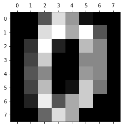
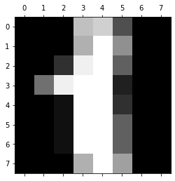

# Image digits classifier
In this project using the support vector machine classifier, we classify digits in the load_digit dataset of sklearn.
Support vector machine is a type of classification machine learning algorithm in which a plane of segregation is created between the different target variables.

# Dataset

This is sklearn's digits dataset which consists of array of handwritten digits.
With the help of Matplotlib we can visualize the data

